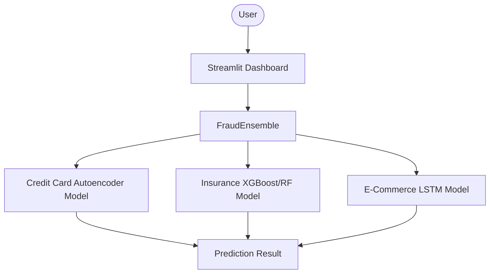

# Multi-Domain Financial Fraud Detection System

A production-ready machine learning framework for detecting fraudulent financial activities across credit card transactions, insurance claims, and e-commerce orders.

## Overview

Financial fraud represents a multi-billion dollar problem across banking, insurance, and retail sectors. Because fraud patterns vary by domain (ranging from individual card thefts to complex organized claims), a single detection algorithm is insufficient. 

This project implements a multi-domain fraud detection architecture using three distinct machine learning strategies optimized for each target domain:
- Credit Card Transactions: Unsupervised anomaly detection using reconstruction error to identify outliers in heavily skewed transaction distributions.
- Insurance Claims: Supervised tree-based models to flag suspicious patterns in customer history, claim metadata, and incident reports.
- E-Commerce Orders: Deep sequential networks to analyze transaction patterns over rolling user history sequences.

By deploying domain-specific models, the system maximizes recall and precision based on each sector's data structures and operational constraints.

## Features

- Credit Card Fraud Detection: Evaluates transaction amounts and timestamps against user patterns using reconstruction anomalies.
- Insurance Fraud Detection: Evaluates policy data, incident severity, claim details, and witness records to detect high-risk submissions.
- E-Commerce Fraud Detection: Analyzes customer characteristics, transaction hours, age of account, and address discrepancies to flag fraudulent orders.
- Interactive Dashboard: Provides web-based interfaces to evaluate individual transaction data in real time.
- Live Analytics: Computes real-time distribution charts and key performance metrics dynamically from session history.
- Prediction History: Tracks and displays details of predictions run during the active session.
- CSV Export: Allows users to download session prediction history for further offline analysis.
- Automatic Hugging Face model download: Automatically pulls trained weights and preprocessing structures on startup.
- Responsive UI: Adaptive layout designed for desktop and mobile browsers.


## Live Demo
Click below link for live demo: 
- https://multi-domain-financial-fraud-detection-system-jxevkcse9kou7mtw.streamlit.app/

## Architecture

The diagram below outlines the system data flow and prediction path:



## Project Structure

```
multi_domain_fraud_detection/
├── dashboard/
│   └── app.py                     # Streamlit dashboard application UI
├── data/
│   └── raw/                       # Raw input CSV datasets
├── results/
│   ├── metrics/                   # Generated evaluation metrics
│   └── plots/                     # Evaluation charts (ROC/F1)
├── saved_models/                  # Serialized model weights and preprocessors
├── scripts/
│   ├── evaluate_all.py            # Aggregated model evaluation script
│   ├── train_autoencoder.py       # Credit Card model training script
│   ├── train_lstm.py              # E-Commerce model training script
│   └── train_random_forest.py     # Insurance model training script
├── src/
│   ├── __init__.py
│   ├── config.py                  # Paths, hyperparameters, and directory setups
│   ├── feature_engineering.py     # Feature engineering functions per domain
│   ├── preprocessing.py           # Preprocessing and dataset splitting utilities
│   ├── models/
│   │   ├── __init__.py
│   │   ├── autoencoder.py         # Autoencoder architecture definition
│   │   ├── ensemble.py            # Inference orchestrator and wrapper class
│   │   ├── lstm_model.py          # LSTM model definition and training loop
│   │   └── random_forest.py       # Random Forest and XGBoost classifiers
│   └── utils/
│       ├── __init__.py
│       └── model_downloader.py    # Hugging Face integration download manager
├── requirements.txt               # Package dependencies
└── runtime.txt                    # Python runtime specification
```

## Machine Learning Models

| Domain | Algorithm | Purpose | Evaluation Metric |
| :--- | :--- | :--- | :--- |
| Credit Card | Autoencoder (Keras) | Unsupervised reconstruction error anomaly detection | Recall, ROC-AUC |
| Insurance | XGBoost / Random Forest | Supervised tabular classification of claims | F1 Score, ROC-AUC |
| E-Commerce | LSTM (Keras) | Sequential classification over historical sequence logs | F1 Score, ROC-AUC |

## Dataset Summary

- Credit Card: Trained on 284,807 transactions. Features V1-V28 are processed via PCA. Preprocessing includes log-scaling the transaction amount, calculating standard deviation deviation, and normalization.
- Insurance: Trained on 1,000 claim records. Discards policy numbers, zip codes, and binding dates. Imputes missing numerical features with medians and categorical features with modes. Engineers binary indicator columns for recent claims and young drivers. Categorical features are encoded via LabelEncoder, training data is balanced using SMOTE, and all inputs are standardized.
- E-Commerce: Trained on a stratified sample of 300,000 transaction sequences. Extracts hour, day of week, month, and weekend indicators. Engineers binary features indicating new accounts, shipping/billing address mismatches, high-value purchases, and unusual transaction hours. Normalizes numeric columns and builds temporal sequences of length 10 for LSTM input.

## Deployment

```
GitHub (Code Repository)
  ↓
Hugging Face Models (Weights Storage)
  ↓
Streamlit Community Cloud (Execution Environment)
```

The system is deployed on Streamlit Community Cloud. Because of file size constraints, large serialized model weights (Keras H5/Keras and Pickle files) are stored in a Hugging Face Models repository. On startup, the download manager checks the local cache, retrieves missing weights from Hugging Face, and loads the models into memory.

## Installation

Ensure Python 3.11+ is installed. Clone the repository and install requirements:

```bash
pip install -r requirements.txt
```

Note: It is recommended to use a Python virtual environment:

```bash
python -m venv venv
source venv/bin/activate  # On Windows: venv\Scripts\activate
pip install -r requirements.txt
```

## Running the Project

To train the models locally (optional, as models download automatically):

```bash
python scripts/train_autoencoder.py
python scripts/train_random_forest.py
python scripts/train_lstm.py
```

To run the evaluation suite:

```bash
python scripts/evaluate_all.py
```

To start the interactive Streamlit dashboard:

```bash
streamlit run dashboard/app.py
```

## Future Improvements

- Introduce ensemble voting models for Credit Card transactions combining isolation forests with neural networks.
- Expand E-Commerce sequence length to capture wider user historical context.
- Implement real-time explainability plots using SHAP or LIME for claim prediction results.

## License

This project is licensed under the MIT License.

## Author

Jenish Upadhyay
Machine Learning Engineer